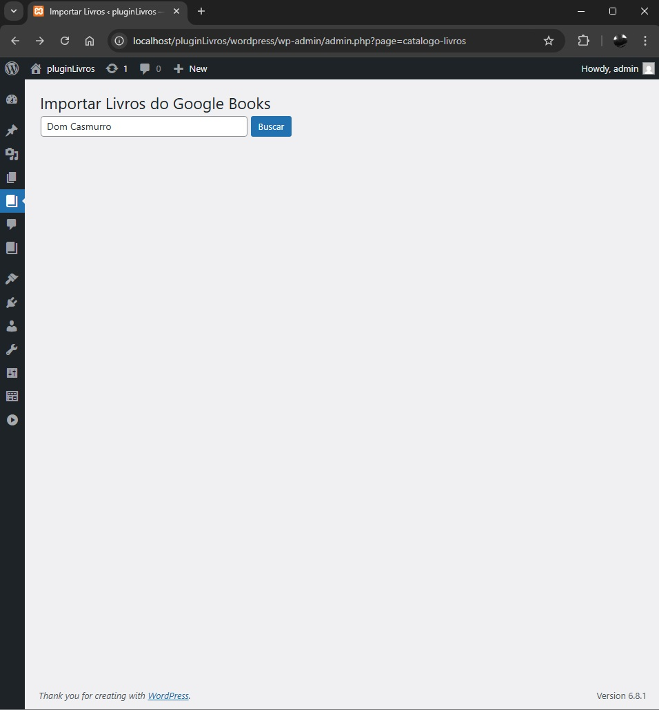
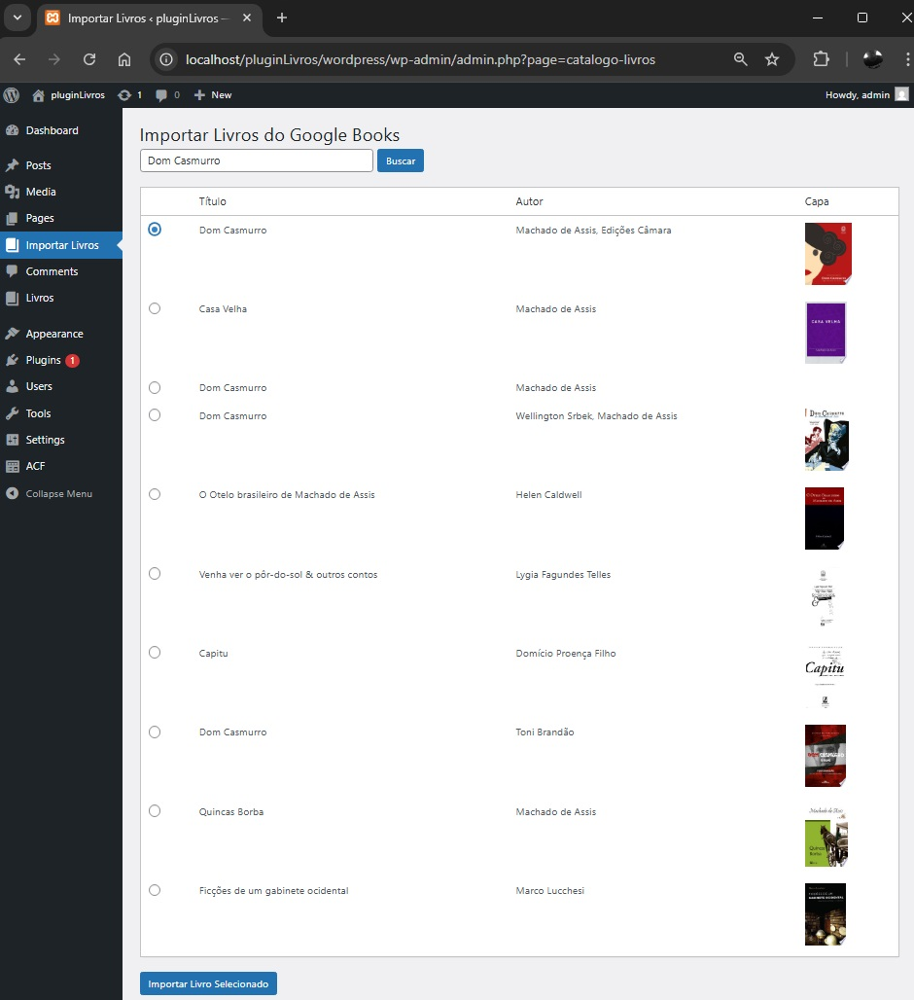
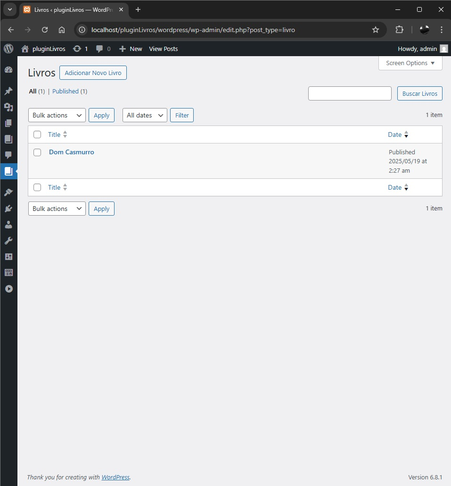

# Catálogo de Livros - Plugin WordPress

Um plugin WordPress que permite buscar e importar livros da API Google Books, criando um catálogo personalizado com campos personalizados usando ACF (Advanced Custom Fields).

## 🚀 Funcionalidades

- Busca de livros na API Google Books
- Importação automática de dados do livro (título, autor, descrição, capa)
- Custom Post Type "Livro" com campos personalizados
- Interface administrativa intuitiva
- Shortcode para exibição do catálogo no front-end
- Design responsivo e moderno

## 📋 Pré-requisitos

- WordPress 5.0 ou superior
- PHP 7.4 ou superior
- Plugin Advanced Custom Fields (ACF) instalado e ativo

## 🔧 Instalação

### Via GitHub

1. Navegue até a pasta `wp-content/plugins` do seu WordPress
2. Clone o repositório:
   ```bash
   git clone https://github.com/seu-usuario/catalogo-livros.git
   ```
3. Acesse o painel administrativo do WordPress
4. Vá em "Plugins" > "Plugins Instalados"
5. Procure por "Catálogo de Livros" e clique em "Ativar"

### Via Upload Manual

1. Faça o download do plugin (botão "Code" > "Download ZIP")
2. Acesse o painel administrativo do WordPress
3. Vá em "Plugins" > "Adicionar Novo" > "Enviar Plugin"
4. Selecione o arquivo ZIP do plugin
5. Clique em "Instalar Agora"
6. Após a instalação, clique em "Ativar Plugin"

## 🎯 Como Usar

### Importando Livros

1. No menu lateral do WordPress, clique em "Importar Livros"
2. Digite o nome do livro que deseja buscar
3. Clique em "Buscar"
4. Selecione o livro desejado da lista de resultados
5. Clique em "Importar Livro Selecionado"

### Exibindo o Catálogo

Para exibir o catálogo de livros em qualquer página ou post, use o shortcode:

```
[catalogo_livros]
```

## 📁 Estrutura do Plugin

```
catalogo-livros/
├── catalogo-livros.php          # Arquivo principal do plugin
├── includes/
│   ├── cpt-livros.php           # Registro do Custom Post Type
│   ├── google-books-api.php     # Integração com API Google Books
│   ├── admin-ui.php             # Interface administrativa
│   └── shortcode.php            # Shortcode para exibição
├── assets/
│   └── style.css                # Estilos do catálogo
└── README.md                    # Este arquivo
```

## 🔍 Detalhes Técnicos

### Custom Post Type
- Nome: `livro`
- Suporta: título, editor, imagem destacada
- Campos personalizados via ACF:
  - Autor (texto)
  - Capa (URL da imagem)

### API Google Books
- Endpoint: `https://www.googleapis.com/books/v1/volumes`
- Busca por termo
- Importa dados básicos do livro

### Shortcode
- Nome: `[catalogo_livros]`
- Exibe todos os livros importados
- Layout responsivo em grid
- Estilização moderna

## 🎨 Personalização

### CSS
O plugin inclui estilos básicos que podem ser sobrescritos pelo tema. As classes principais são:

```css
.catalogo-livros-lista    /* Container principal */
.catalogo-livro-item     /* Item individual do livro */
```

### Campos ACF
Os campos personalizados são registrados automaticamente, mas podem ser modificados via interface do ACF:

- Grupo: "Informações do Livro"
- Campos: Autor e Capa

## 🔒 Segurança

- Todas as entradas são sanitizadas
- URLs são validadas
- Dados da API são escapados
- Verificações de permissões implementadas
  




## 🤝 Contribuindo

1. Faça um Fork do projeto
2. Crie uma Branch para sua Feature (`git checkout -b feature/AmazingFeature`)
3. Commit suas mudanças (`git commit -m 'Add some AmazingFeature'`)
4. Push para a Branch (`git push origin feature/AmazingFeature`)
5. Abra um Pull Request

## 📝 Licença

Este projeto está sob a licença MIT. Veja o arquivo [LICENSE](LICENSE) para mais detalhes.

## ✨ Agradecimentos

- [WordPress](https://wordpress.org)
- [Advanced Custom Fields](https://www.advancedcustomfields.com)
- [Google Books API](https://developers.google.com/books)

## 📧 Suporte

Para reportar bugs ou sugerir melhorias, por favor abra uma issue no GitHub.

